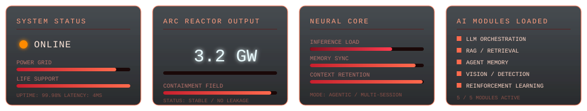
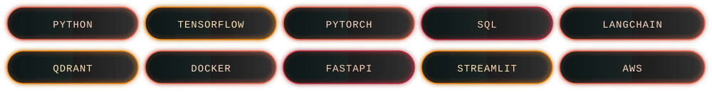

 

 

&nbsp;

&nbsp;

&nbsp;

 

## TECH STACK

 

## MISSION LOG

<table>
<tr><th align="left">RECORD</th><th align="left">LOCATION / YEAR</th><th align="left">DETAIL</th></tr>
<tr>
<td><b>1ST PRIZE — IEEE HACK4HUMANITY</b></td>
<td>Pune, 2026</td>
<td>Presented <b>StateJar</b>, a deterministic memory architecture for multi-session conversational AI — recognized for innovation in LLM memory, context retention, and privacy-preserving AI systems.</td>
</tr>
<tr>
<td><b>2ND RUNNER-UP — NATIONAL LEVEL IDEATHON</b></td>
<td>Pune, 2025</td>
<td>AI-driven solution for marginal farmers, competing against top student innovators nationwide.</td>
</tr>
<tr>
<td><b>RESEARCH PUBLICATION</b></td>
<td>2025</td>
<td>Co-authored "The Impact of AI in the Indian Economy" — Progress in Economics Research (Nova Publications). ISBN: 979-8-89530-752-6. <a href="https://lnkd.in/d3bAhmEh">DOI</a>.</td>
</tr>
<tr>
<td><b>2ND RUNNER-UP — INTERNATIONAL KAGGLE HACX HACKATHON</b></td>
<td>Pune, 2026</td>
<td>Ensemble deep learning pipeline for eye disease classification — EfficientNet + ConvNeXt, advanced preprocessing, Test-Time Augmentation (TTA).</td>
</tr>
<tr>
<td><b>SEMI-FINALIST — SMART INDIA HACKATHON (SIH)</b></td>
<td>National</td>
<td>AI-driven innovation solution, selected among top teams across India.</td>
</tr>
</table>

 

## DEPLOYMENTS

<table>
<tr><th align="left">PROJECT</th><th align="left">DESCRIPTION</th><th align="left">STACK</th></tr>
<tr>
<td><b>StateJar</b></td>
<td>Award-winning deterministic memory architecture for multi-session conversational AI — context retention and privacy-preserving design.</td>
<td>LLMs, Memory Systems, Python</td>
</tr>
<tr>
<td><b>DhartiQ</b></td>
<td>End-to-end AI system engineered to solve structured real-world problems with complete pipeline design and implementation.</td>
<td>Python, ML, DL</td>
</tr>
<tr>
<td><b>Carbon Copilot</b></td>
<td>Enterprise carbon intelligence platform — LLMs and retrieval systems to automate emission tracking and generate sustainability insights.</td>
<td>LLMs, RAG, NLP</td>
</tr>
<tr>
<td><b>DataMate</b></td>
<td>GPT-powered AI assistant that analyzes datasets and surfaces meaningful insights through natural language interaction.</td>
<td>GPT, Streamlit, Pandas</td>
</tr>
<tr>
<td><b>GPT-2 From Scratch</b></td>
<td>Full implementation of GPT-2 architecture built ground-up — understanding transformers at the deepest level.</td>
<td>PyTorch, Transformers</td>
</tr>
<tr>
<td><b>RL Projects</b></td>
<td>Collection of reinforcement learning experiments — policy gradients, Q-learning, multi-agent environments.</td>
<td>PyTorch, Gym, RL</td>
</tr>
</table>

 

## DIAGNOSTICS

  
  &nbsp;
  

  

  

 

## OPEN CHANNEL

&nbsp;

&nbsp;

  
OPEN TO COLLABORATIONS, RESEARCH PROJECTS, AND AI ENGINEERING OPPORTUNITIES.

<picture>
  <source media="(prefers-color-scheme: dark)" srcset="https://raw.githubusercontent.com/bit-bard/bit-bard/output/github-contribution-grid-snake-dark.svg"/>
  <source media="(prefers-color-scheme: light)" srcset="https://raw.githubusercontent.com/bit-bard/bit-bard/output/github-contribution-grid-snake.svg"/>
  
</picture>

